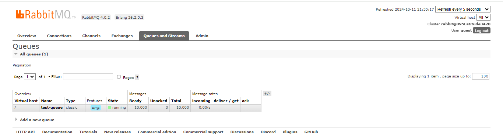
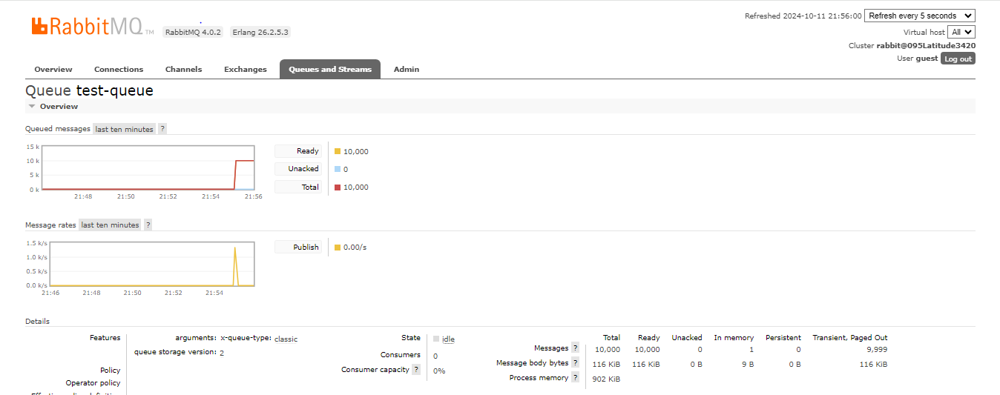
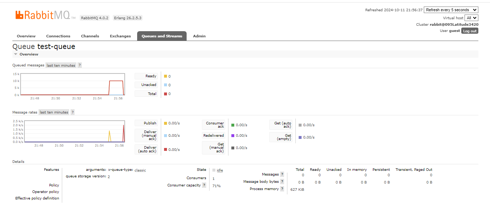

# RabbitMQ Message Queue System Analysis Report

## Table of Contents
1. [Introduction](#introduction)
2. [Queue Overview and Observations](#queue-overview-and-observations)
   - [Queue Status](#queue-status)
   - [Message Processing Rates](#message-processing-rates)
3. [Performance Analysis](#performance-analysis)
4. [Conclusion](#conclusion)
5. [Attachments](#attachments)

## 1. Introduction
This report summarizes the implementation and analysis of a RabbitMQ-based message queue system. The objective was to ensure reliable message exchange between a Producer and a Consumer application. The system transmitted 10,000 messages from the Producer to the Consumer using a RabbitMQ queue, validating that no messages were lost in the process.

---

## 2. Queue Overview and Observations

### 2.1 Queue Status
Based on the RabbitMQ dashboard screenshot, the following key observations were made:
- **Queue Name:** test-queue
- **Total Messages:** 0
- **Ready Messages:** 0 (All messages consumed)
- **Unacked Messages:** 0 (No pending acknowledgments)

The RabbitMQ queue is shown to be **idle** with no messages left, indicating that all messages were successfully consumed. This confirms that the Consumer processed all messages and acknowledged receipt for each one.

### 2.2 Message Processing Rates
The message rate graph displays:
- **Publish Rate:** Initially high as the Producer was sending messages.
- **Consumer Acknowledgment Rate:** Corresponds to the rate of message consumption by the Consumer.
- **No Unacked or Lost Messages:** The graph shows zero unacked messages, confirming reliable delivery.

The message consumption process operated smoothly with no noticeable delays or bottlenecks. 

---

## 3. Performance Analysis

- **Message Loss:** None. The system confirms that all messages were consumed successfully by the Consumer, with no loss or delay.
- **System Throughput:** The RabbitMQ system handled the 10,000 messages efficiently, and the queue was cleared promptly.
- **State of Queue:** At the time of screenshot capture, the queue had returned to an idle state, indicating that the consumer finished processing all messages.

### Screenshot Evidence
- **Queue State:** Idle with 0 messages remaining (as shown in the screenshot).
- **Consumer:** 1 active consumer completed the task.
- **Consumer Capacity Utilization:** 71%, indicating efficient message processing without overwhelming the consumer.

---

## 4. Conclusion

The RabbitMQ message queue system functioned as expected. The Producer successfully transmitted 10,000 messages, and the Consumer processed them without any loss or unacknowledged messages. The system's asynchronous messaging model ensured that all messages were stored safely until consumed, providing fault tolerance.

### Key Takeaways:
- **No Message Loss:** Confirmed by queue status showing 0 unacked and 0 remaining messages.
- **Reliable Processing:** The Consumer application processed messages smoothly and acknowledged them.
- **System Efficiency:** The queue transitioned back to an idle state after processing, demonstrating the system's ability to handle large workloads.

The screenshot supports these findings, confirming that RabbitMQ was correctly configured and utilized.

---
